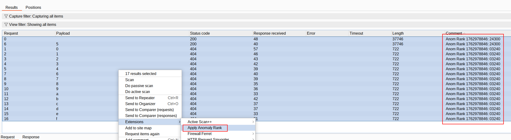

# Burp Extension: Anomaly Rank Right Click Context Menu

_By [Nick Coblentz](https://www.linkedin.com/in/ncoblentz/)_

__This Burp Extension Template is made possible by [Virtue Security](https://www.virtuesecurity.com), the Application Penetration Testing consulting company I work for.__

This project allows you to select multiple requests and then right-click on them and select "Apply Anomaly Rank". It will then calculate the rank for each request and display it in the notes section of the request.

## How to Use It

- Build it with `gradlew shadowJar`
- Add the extension in burp from the `build/libs/ApplyAnomalyRank-x.y.z-all.jar` folder where `x.y.z` represents the build version